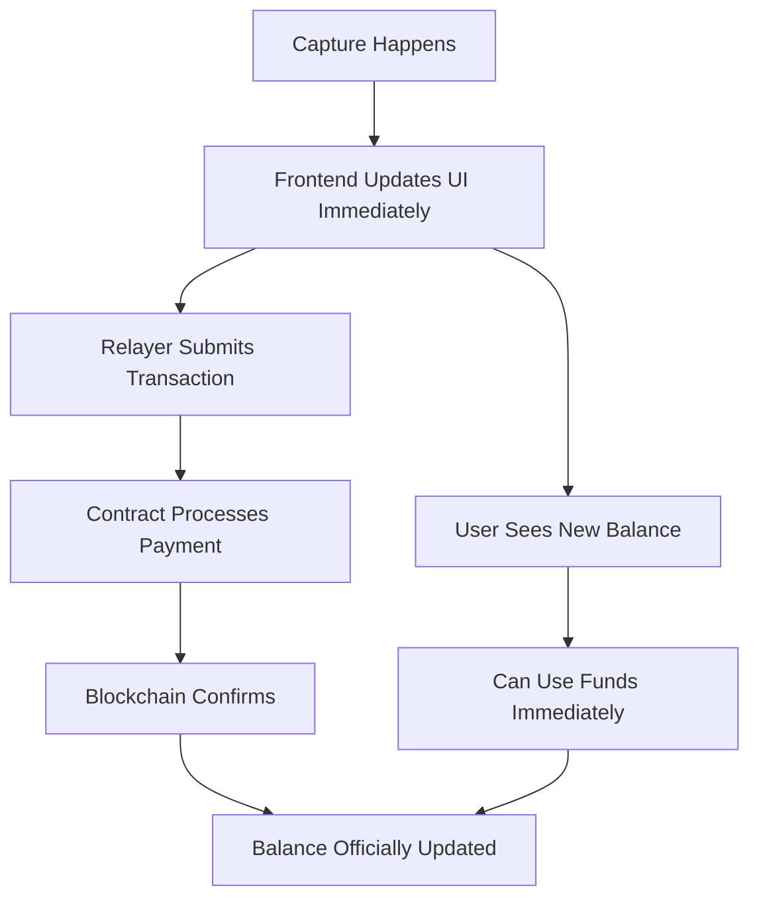

# MiniChess 🎮♟️💰

A pay-per-capture chess game built on Celo where every piece has real value. As pieces are captured, funds are transferred instantly between players using MiniPay integration.

## 🎯 Concept

MiniChess revolutionizes chess by adding financial stakes to every move. Players deposit funds into an escrow contract, and as pieces are captured during gameplay, the captor receives instant payment based on the piece's rank. This creates genuine tension and strategic depth where every move has real consequences.

### Piece Values
- **Pawn**: $0.05 cUSD (8 pieces = $0.40)
- **Knight**: $0.15 cUSD (2 pieces = $0.30)
- **Bishop**: $0.15 cUSD (2 pieces = $0.30)
- **Rook**: $0.25 cUSD (2 pieces = $0.50)
- **Queen**: $0.50 cUSD (1 piece = $0.50)
- **King**: Ends game + remaining escrow

**Total Escrow per Player**: $2.50 cUSD (covers all 16 pieces)

---

## 🔄 Gasless Gameplay with Paymaster

**NEW**: Implement gasless transactions using Pimlico paymaster for seamless user experience!

📖 **Complete Guide**: [Paymaster Implementation Guide](./Paymaster-Implementation-Guide.md)
🔧 **Integration Examples**: [Code Examples & Migration Guide](./examples/Paymaster-Integration-Example.md)

### Why Use Paymaster?
- **No gas fees** for players
- **Instant transactions** without wallet popups
- **Better UX** than traditional relayer system
- **Cost predictable** with sponsored transactions
- **No infrastructure** to maintain

---

## 🏗️ Architecture Overview

```
┌─────────────────┐
│   MiniPay App   │
│  (User Wallet)  │
└────────┬────────┘
         │
         │ Session Key Creation
         │
┌────────▼────────────────────────────────┐
│        Next.js Frontend                 │
│  ┌──────────────┐    ┌──────────────┐  │
│  │ Chess Board  │◄──►│  Game Logic  │  │
│  │   (UI)       │    │  (chess.js)  │  │
│  └──────────────┘    └──────┬───────┘  │
│                              │          │
│  ┌──────────────────────────▼───────┐  │
│  │   Seamless Capture Handler       │  │
│  │   - Optimistic Updates         │  │
│  │   - Session Key Management     │  │
│  └──────────────┬───────────────────┘  │
└─────────────────┼───────────────────────┘
                  │
                  │ API Calls
                  │
┌─────────────────▼───────────────────────┐
│         Backend Relayer Service          │
│  ┌─────────────────────────────────┐   │
│  │  Transaction Submission        │   │
│  │  - Gas Management            │   │
│  │  - Batch Processing          │   │
│  │  - Error Handling           │   │
│  └──────────────┬───────────────────┘   │
└─────────────────┼───────────────────────┘
                  │
                  │ Web3 Calls
                  │
┌─────────────────▼───────────────────────┐
│         Celo Blockchain                 │
│  ┌─────────────────────────────────┐   │
│  │  MiniChessEscrowSeamless.sol  │   │
│  │  - Pre-Authorization          │   │
│  │  - Session Validation        │   │
│  │  - Gasless Capture Logic     │   │
│  └─────────────────────────────────┘   │
└─────────────────────────────────────────┘
```

---

## 📋 Prerequisites

Before starting, ensure you have:

- Node.js 18+ installed
- Foundry installed for smart contract development
- MetaMask or MiniPay wallet
- Git
- A code editor (VS Code recommended)
- Basic understanding of React, Solidity, and Web3

---

## 🚀 Part 1: Smart Contract Development with Foundry

### Step 1: Project Setup

```bash
# Create project directory
mkdir minichess
cd minichess

# Initialize Foundry project
forge init minichess-contracts
cd minichess-contracts

# Install OpenZeppelin contracts
forge install OpenZeppelin/openzeppelin-contracts --no-commit
```

### Step 2: Create the Smart Contract

Create `src/MiniChessEscrow.sol`:

```solidity
// SPDX-License-Identifier: MIT
pragma solidity ^0.8.20;

import "@openzeppelin/contracts/security/ReentrancyGuard.sol";
import "@openzeppelin/contracts/token/ERC20/IERC20.sol";

/**
 * @title MiniChessEscrow
 * @dev Manages chess games with pay-per-capture mechanics
 */
contract MiniChessEscrow is ReentrancyGuard {
    
    // cUSD token address on Celo Mainnet
    address public constant CUSD_TOKEN = 0x765DE816845861e75A25fCA122bb6898B8B1282a;
    // For Alfajores testnet: 0x874069Fa1Eb16D44d622F2e0Ca25eeA172369bC1
    
    IERC20 public cUSD;
    
    // Piece values in cUSD (with 18 decimals)
    uint256 public constant PAWN_VALUE = 0.05 ether;   // 8 pawns = 0.4 ether
    uint256 public constant KNIGHT_VALUE = 0.15 ether; // 2 knights = 0.3 ether
    uint256 public constant BISHOP_VALUE = 0.15 ether; // 2 bishops = 0.3 ether
    uint256 public constant ROOK_VALUE = 0.25 ether;   // 2 rooks = 0.5 ether
    uint256 public constant QUEEN_VALUE = 0.5 ether;   // 1 queen = 0.5 ether
    // King has no capture value
    // Total: 0.4 + 0.3 + 0.3 + 0.5 + 0.5 = 2.0 ether (capturable pieces)
    
    // Total escrow needed per player (16 pieces)
    uint256 public constant ESCROW_AMOUNT = 2.5 ether;
    
    enum PieceType { PAWN, KNIGHT, BISHOP, ROOK, QUEEN, KING }
    enum GameStatus { WAITING, ACTIVE, FINISHED, CANCELLED }
    
    struct Game {
        address player1;
        address player2;
        uint256 player1Escrow;
        uint256 player2Escrow;
        uint256 player1Balance;
        uint256 player2Balance;
        GameStatus status;
        address winner;
        uint256 createdAt;
    }
    
    mapping(uint256 => Game) public games;
    uint256 public gameCounter;
    
    // Events
    event GameCreated(uint256 indexed gameId, address indexed player1);
    event PlayerJoined(uint256 indexed gameId, address indexed player2);
    event PieceCaptured(
        uint256 indexed gameId, 
        address indexed captor, 
        PieceType pieceType, 
        uint256 amount
    );
    event GameEnded(
        uint256 indexed gameId, 
        address indexed winner,
        uint256 player1Payout,
        uint256 player2Payout
    );
    event GameCancelled(uint256 indexed gameId);
    
    constructor() {
        cUSD = IERC20(CUSD_TOKEN);
    }
    
    /**
     * @dev Create a new game and deposit escrow
     */
    function createGame() external nonReentrant returns (uint256) {
        require(
            cUSD.transferFrom(msg.sender, address(this), ESCROW_AMOUNT),
            "Escrow transfer failed"
        );
        
        gameCounter++;
        uint256 gameId = gameCounter;
        
        games[gameId] = Game({
            player1: msg.sender,
            player2: address(0),
            player1Escrow: ESCROW_AMOUNT,
            player2Escrow: 0,
            player1Balance: ESCROW_AMOUNT,
            player2Balance: 0,
            status: GameStatus.WAITING,
            winner: address(0),
            createdAt: block.timestamp
        });
        
        emit GameCreated(gameId, msg.sender);
        return gameId;
    }
    
    /**
     * @dev Join an existing game
     */
    function joinGame(uint256 gameId) external nonReentrant {
        Game storage game = games[gameId];
        require(game.status == GameStatus.WAITING, "Game not available");
        require(game.player1 != msg.sender, "Cannot play against yourself");
        require(game.player2 == address(0), "Game already full");
        
        require(
            cUSD.transferFrom(msg.sender, address(this), ESCROW_AMOUNT),
            "Escrow transfer failed"
        );
        
        game.player2 = msg.sender;
        game.player2Escrow = ESCROW_AMOUNT;
        game.player2Balance = ESCROW_AMOUNT;
        game.status = GameStatus.ACTIVE;
        
        emit PlayerJoined(gameId, msg.sender);
    }
    
    /**
     * @dev Record a piece capture and transfer funds
     */
    function recordCapture(
        uint256 gameId,
        address captor,
        PieceType pieceType
    ) external nonReentrant {
        Game storage game = games[gameId];
        require(game.status == GameStatus.ACTIVE, "Game not active");
        require(
            captor == game.player1 || captor == game.player2,
            "Invalid captor"
        );
        
        uint256 captureValue = getPieceValue(pieceType);
        
        // Determine victim and update balances
        if (captor == game.player1) {
            require(game.player2Balance >= captureValue, "Insufficient balance");
            game.player2Balance -= captureValue;
            game.player1Balance += captureValue;
        } else {
            require(game.player1Balance >= captureValue, "Insufficient balance");
            game.player1Balance -= captureValue;
            game.player2Balance += captureValue;
        }
        
        emit PieceCaptured(gameId, captor, pieceType, captureValue);
    }
    
    /**
     * @dev End game and distribute remaining balances
     */
    function endGame(uint256 gameId, address winner) external nonReentrant {
        Game storage game = games[gameId];
        require(game.status == GameStatus.ACTIVE, "Game not active");
        require(
            winner == game.player1 || winner == game.player2,
            "Invalid winner"
        );
        
        game.status = GameStatus.FINISHED;
        game.winner = winner;
        
        uint256 player1Payout = game.player1Balance;
        uint256 player2Payout = game.player2Balance;
        
        // Reset balances before transfer
        game.player1Balance = 0;
        game.player2Balance = 0;
        
        // Transfer final balances
        if (player1Payout > 0) {
            require(
                cUSD.transfer(game.player1, player1Payout),
                "Player 1 payout failed"
            );
        }
        
        if (player2Payout > 0) {
            require(
                cUSD.transfer(game.player2, player2Payout),
                "Player 2 payout failed"
            );
        }
        
        emit GameEnded(gameId, winner, player1Payout, player2Payout);
    }
    
    /**
     * @dev Cancel a game that hasn't started (refund player 1)
     */
    function cancelGame(uint256 gameId) external nonReentrant {
        Game storage game = games[gameId];
        require(game.status == GameStatus.WAITING, "Can only cancel waiting games");
        require(game.player1 == msg.sender, "Only creator can cancel");
        require(
            block.timestamp >= game.createdAt + 5 minutes,
            "Must wait 5 minutes before cancelling"
        );
        
        game.status = GameStatus.CANCELLED;
        uint256 refund = game.player1Escrow;
        game.player1Escrow = 0;
        
        require(cUSD.transfer(game.player1, refund), "Refund failed");
        
        emit GameCancelled(gameId);
    }
    
    /**
     * @dev Get piece value
     */
    function getPieceValue(PieceType pieceType) public pure returns (uint256) {
        if (pieceType == PieceType.PAWN) return PAWN_VALUE;
        if (pieceType == PieceType.KNIGHT) return KNIGHT_VALUE;
        if (pieceType == PieceType.BISHOP) return BISHOP_VALUE;
        if (pieceType == PieceType.ROOK) return ROOK_VALUE;
        if (pieceType == PieceType.QUEEN) return QUEEN_VALUE;
        return 0; // King has no capture value
    }
    
    /**
     * @dev Get game details
     */
    function getGame(uint256 gameId) external view returns (Game memory) {
        return games[gameId];
    }
}
```

### Step 3: Configure Foundry

Update `foundry.toml`:

```toml
[profile.default]
src = "src"
out = "out"
libs = ["lib"]
solc_version = "0.8.20"

[profile.default.optimizer]
enabled = true
runs = 200

[rpc_endpoints]
alfajores = "https://alfajores-forno.celo-testnet.org"
celo = "https://forno.celo.org"

[etherscan]
alfajores = { key = "${CELOSCAN_API_KEY}", url = "https://api-alfajores.celoscan.io/api" }
celo = { key = "${CELOSCAN_API_KEY}", url = "https://api.celoscan.io/api" }
```

### Step 4: Create .env File

Create `.env` in the contracts directory:

```bash
PRIVATE_KEY=your_private_key_here
CELOSCAN_API_KEY=your_celoscan_api_key_here
```

### Step 5: Write Deployment Script

Create `script/Deploy.s.sol`:

```solidity
// SPDX-License-Identifier: MIT
pragma solidity ^0.8.20;

import "forge-std/Script.sol";
import "../src/MiniChessEscrow.sol";

contract DeployScript is Script {
    function run() external {
        uint256 deployerPrivateKey = vm.envUint("PRIVATE_KEY");
        vm.startBroadcast(deployerPrivateKey);
        
        MiniChessEscrow escrow = new MiniChessEscrow();
        
        vm.stopBroadcast();
        
        console.log("MiniChessEscrow deployed to:");
        console.log(address(escrow));
    }
}
```

### Step 6: Get Test Tokens

1. Get CELO tokens from faucet: https://faucet.celo.org/alfajores
2. Swap for cUSD on Ubeswap testnet or use the faucet

### Step 7: Deploy Contract

```bash
# Build contracts
forge build

# Deploy to Alfajores testnet
forge script script/Deploy.s.sol --rpc-url alfajores --broadcast --verify

# Save the deployed contract address!
```

---

## 🎨 Part 2: Next.js Frontend Development with Compose Kit

### Step 1: Create Next.js App with Compose Kit

```bash
# Navigate back to project root
cd ..

# Create Next.js app using Celo Compose Kit
npx @celo/celo-composer create minichess-frontend
# Select: Next.js + Tailwind CSS + MiniPay template

cd minichess-frontend
```

### Step 2: Install Additional Dependencies

```bash
npm install chess.js wagmi viem @rainbow-me/rainbowkit
npm install react-chessboard
npm install @celo/abis
```

### Step 3: Configure Wagmi

Create `lib/wagmi.ts`:

```typescript
import { http, createConfig } from 'wagmi';
import { celo, celoAlfajores } from 'wagmi/chains';
import { injected } from 'wagmi/connectors';

export const config = createConfig({
  chains: [celoAlfajores, celo],
  connectors: [injected()],
  transports: {
    [celoAlfajores.id]: http(),
    [celo.id]: http(),
  },
});
```

### Step 4: Create Contract ABI

Create `contracts/MiniChessEscrow.json` with your contract ABI (generated during compilation in `minichess-contracts/out`).

### Step 5: Environment Variables

Create `.env.local`:

```bash
NEXT_PUBLIC_CONTRACT_ADDRESS=your_deployed_contract_address
NEXT_PUBLIC_CUSD_ADDRESS=0x874069Fa1Eb16D44d622F2e0Ca25eeA172369bC1
NEXT_PUBLIC_NETWORK=alfajores
```

### Step 6: Create Game Hook

Create `hooks/useChessGame.ts`:

```typescript
import { useAccount, useWriteContract, useReadContract } from 'wagmi';
import { parseEther } from 'viem';
import CONTRACT_ABI from '@/contracts/MiniChessEscrow.json';

const CONTRACT_ADDRESS = process.env.NEXT_PUBLIC_CONTRACT_ADDRESS as `0x${string}`;

export function useChessGame() {
  const { address } = useAccount();
  const { writeContractAsync } = useWriteContract();

  const createGame = async () => {
    try {
      // First approve cUSD spending
      await approveToken();
      
      // Then create game
      const hash = await writeContractAsync({
        address: CONTRACT_ADDRESS,
        abi: CONTRACT_ABI.abi,
        functionName: 'createGame',
      });
      
      return hash;
    } catch (error) {
      console.error('Create game error:', error);
      throw error;
    }
  };

  const joinGame = async (gameId: number) => {
    try {
      await approveToken();
      
      const hash = await writeContractAsync({
        address: CONTRACT_ADDRESS,
        abi: CONTRACT_ABI.abi,
        functionName: 'joinGame',
        args: [BigInt(gameId)],
      });
      
      return hash;
    } catch (error) {
      console.error('Join game error:', error);
      throw error;
    }
  };

  const recordCapture = async (
    gameId: number,
    captor: string,
    pieceType: number
  ) => {
    try {
      const hash = await writeContractAsync({
        address: CONTRACT_ADDRESS,
        abi: CONTRACT_ABI.abi,
        functionName: 'recordCapture',
        args: [BigInt(gameId), captor as `0x${string}`, pieceType],
      });
      
      return hash;
    } catch (error) {
      console.error('Record capture error:', error);
      throw error;
    }
  };

  const endGame = async (gameId: number, winner: string) => {
    try {
      const hash = await writeContractAsync({
        address: CONTRACT_ADDRESS,
        abi: CONTRACT_ABI.abi,
        functionName: 'endGame',
        args: [BigInt(gameId), winner as `0x${string}`],
      });
      
      return hash;
    } catch (error) {
      console.error('End game error:', error);
      throw error;
    }
  };

  const approveToken = async () => {
    const CUSD_ADDRESS = process.env.NEXT_PUBLIC_CUSD_ADDRESS as `0x${string}`;
    const CUSD_ABI = [
      {
        inputs: [
          { name: 'spender', type: 'address' },
          { name: 'amount', type: 'uint256' }
        ],
        name: 'approve',
        outputs: [{ name: '', type: 'bool' }],
        stateMutability: 'nonpayable',
        type: 'function'
      }
    ];

    await writeContractAsync({
      address: CUSD_ADDRESS,
      abi: CUSD_ABI,
      functionName: 'approve',
      args: [CONTRACT_ADDRESS, parseEther('2.5')],
    });
  };

  return {
    createGame,
    joinGame,
    recordCapture,
    endGame,
  };
}
```

### Step 7: Create Chess Component

Create `components/ChessBoard.tsx`:

```typescript
'use client';

import { useState, useEffect } from 'react';
import { Chessboard } from 'react-chessboard';
import { Chess } from 'chess.js';
import { useChessGame } from '@/hooks/useChessGame';
import { useAccount } from 'wagmi';

interface ChessBoardProps {
  gameId: number;
  player1: string;
  player2: string;
}

const PIECE_VALUES = {
  p: 0.05, // Pawn
  n: 0.15, // Knight
  b: 0.15, // Bishop
  r: 0.25, // Rook
  q: 0.50, // Queen
  k: 0,    // King
};

const PIECE_TYPE_MAP: Record<string, number> = {
  p: 0, // PAWN
  n: 1, // KNIGHT
  b: 2, // BISHOP
  r: 3, // ROOK
  q: 4, // QUEEN
  k: 5, // KING
};

export default function ChessBoard({ gameId, player1, player2 }: ChessBoardProps) {
  const [game, setGame] = useState(new Chess());
  const [player1Balance, setPlayer1Balance] = useState(2.5);
  const [player2Balance, setPlayer2Balance] = useState(2.5);
  const { address } = useAccount();
  const { recordCapture, endGame } = useChessGame();

  const isMyTurn = () => {
    const turn = game.turn();
    if (turn === 'w' && address === player1) return true;
    if (turn === 'b' && address === player2) return true;
    return false;
  };

  function makeMove(sourceSquare: string, targetSquare: string) {
    if (!isMyTurn()) {
      alert('Not your turn!');
      return false;
    }

    const gameCopy = new Chess(game.fen());
    const move = gameCopy.move({
      from: sourceSquare,
      to: targetSquare,
      promotion: 'q',
    });

    if (move === null) return false;

    setGame(gameCopy);

    // Handle capture
    if (move.captured) {
      const capturedValue = PIECE_VALUES[move.captured as keyof typeof PIECE_VALUES];
      const captor = address;
      const victim = captor === player1 ? player2 : player1;

      // Update local balances
      if (captor === player1) {
        setPlayer1Balance(prev => prev + capturedValue);
        setPlayer2Balance(prev => prev - capturedValue);
      } else {
        setPlayer2Balance(prev => prev + capturedValue);
        setPlayer1Balance(prev => prev - capturedValue);
      }

      // Record on blockchain
      const pieceType = PIECE_TYPE_MAP[move.captured];
      recordCapture(gameId, captor!, pieceType).catch(console.error);
    }

    // Check for game over
    if (gameCopy.isGameOver()) {
      const winner = gameCopy.turn() === 'w' ? player2 : player1;
      endGame(gameId, winner).catch(console.error);
      
      setTimeout(() => {
        if (gameCopy.isCheckmate()) {
          alert(`Checkmate! ${winner === address ? 'You' : 'Opponent'} won!`);
        } else {
          alert('Game ended in a draw!');
        }
      }, 500);
    }

    return true;
  }

  return (
    <div className="flex flex-col items-center gap-6 p-4">
      <div className="w-full max-w-md">
        <div className="mb-4 flex justify-between text-sm font-semibold">
          <div className="flex flex-col">
            <span>Player 1 {address === player1 && '(You)'}</span>
            <span className="text-green-600">${player1Balance.toFixed(2)} cUSD</span>
          </div>
          <div className="flex flex-col text-right">
            <span>Player 2 {address === player2 && '(You)'}</span>
            <span className="text-green-600">${player2Balance.toFixed(2)} cUSD</span>
          </div>
        </div>

        <Chessboard
          position={game.fen()}
          onPieceDrop={makeMove}
          boardOrientation={address === player1 ? 'white' : 'black'}
        />

        <div className="mt-4 text-center text-sm">
          {isMyTurn() ? (
            <span className="text-green-600 font-bold">Your turn!</span>
          ) : (
            <span className="text-gray-500">Opponent's turn...</span>
          )}
        </div>
      </div>
    </div>
  );
}
```

### Step 8: Create Game Lobby Page

Create `app/page.tsx`:

```typescript
'use client';

import { useState } from 'react';
import { useAccount } from 'wagmi';
import { useChessGame } from '@/hooks/useChessGame';
import ChessBoard from '@/components/ChessBoard';

export default function Home() {
  const { address, isConnected } = useAccount();
  const { createGame, joinGame } = useChessGame();
  const [gameId, setGameId] = useState<number | null>(null);
  const [joinGameId, setJoinGameId] = useState('');
  const [isLoading, setIsLoading] = useState(false);
  const [player1, setPlayer1] = useState('');
  const [player2, setPlayer2] = useState('');

  const handleCreateGame = async () => {
    setIsLoading(true);
    try {
      await createGame();
      alert('Game created! Share the game ID with your opponent.');
      // You would get the gameId from the transaction receipt
    } catch (error) {
      alert('Failed to create game');
    } finally {
      setIsLoading(false);
    }
  };

  const handleJoinGame = async () => {
    if (!joinGameId) return;
    
    setIsLoading(true);
    try {
      await joinGame(parseInt(joinGameId));
      setGameId(parseInt(joinGameId));
      // Fetch player addresses from contract
    } catch (error) {
      alert('Failed to join game');
    } finally {
      setIsLoading(false);
    }
  };

  if (!isConnected) {
    return (
      <div className="min-h-screen flex items-center justify-center">
        <div className="text-center">
          <h1 className="text-4xl font-bold mb-4">MiniChess ♟️</h1>
          <p className="mb-4">Please open this app in MiniPay</p>
        </div>
      </div>
    );
  }

  if (gameId && player1 && player2) {
    return (
      <div className="min-h-screen p-4">
        <h1 className="text-3xl font-bold text-center mb-6">MiniChess - Game #{gameId}</h1>
        <ChessBoard gameId={gameId} player1={player1} player2={player2} />
      </div>
    );
  }

  return (
    <div className="min-h-screen flex items-center justify-center p-4">
      <div className="max-w-md w-full space-y-8">
        <div className="text-center">
          <h1 className="text-4xl font-bold mb-2">MiniChess ♟️</h1>
          <p className="text-gray-600">Pay-per-capture chess on Celo</p>
        </div>

        <div className="bg-white shadow-lg rounded-lg p-6 space-y-6">
          <div>
            <h2 className="text-xl font-semibold mb-4">Create New Game</h2>
            <p className="text-sm text-gray-600 mb-4">
              Deposit 2.5 cUSD to start a game
            </p>
            <button
              onClick={handleCreateGame}
              disabled={isLoading}
              className="w-full bg-green-600 text-white py-3 rounded-lg font-semibold hover:bg-green-700 disabled:opacity-50"
            >
              {isLoading ? 'Creating...' : 'Create Game'}
            </button>
          </div>

          <div className="border-t pt-6">
            <h2 className="text-xl font-semibold mb-4">Join Existing Game</h2>
            <input
              type="text"
              placeholder="Enter Game ID"
              value={joinGameId}
              onChange={(e) => setJoinGameId(e.target.value)}
              className="w-full border rounded-lg p-3 mb-4"
            />
            <button
              onClick={handleJoinGame}
              disabled={isLoading || !joinGameId}
              className="w-full bg-blue-600 text-white py-3 rounded-lg font-semibold hover:bg-blue-700 disabled:opacity-50"
            >
              {isLoading ? 'Joining...' : 'Join Game'}
            </button>
          </div>
        </div>

        <div className="bg-gray-50 rounded-lg p-4 text-sm">
          <h3 className="font-semibold mb-2">How it works:</h3>
          <ul className="list-disc list-inside space-y-1 text-gray-700">
            <li>Each piece has a value (Pawn: $0.05 → Queen: $0.50)</li>
            <li>When you capture, you earn the piece's value instantly</li>
            <li>Starting escrow: $2.50 cUSD per player</li>
            <li>Winner keeps their remaining balance</li>
          </ul>
        </div>
      </div>
    </div>
  );
}
```

### Step 9: Add Wagmi Provider

Update `app/layout.tsx`:

```typescript
'use client';

import { WagmiProvider } from 'wagmi';
import { QueryClient, QueryClientProvider } from '@tanstack/react-query';
import { config } from '@/lib/wagmi';

const queryClient = new QueryClient();

export default function RootLayout({
  children,
}: {
  children: React.ReactNode;
}) {
  return (
    <html lang="en">
      <body>
        <WagmiProvider config={config}>
          <QueryClientProvider client={queryClient}>
            {children}
          </QueryClientProvider>
        </WagmiProvider>
      </body>
    </html>
  );
}
```

---

## 🔄 Part 3: Transaction Flow Options

MiniChess supports two approaches for gasless gameplay:

### Option A: Relayer System (Current Implementation)
- ✅ **Pros**: Full control, custom logic
- ❌ **Cons**: Requires infrastructure, gas management
- 📖 **Implementation**: See below

### Option B: Pimlico Paymaster (Recommended)
- ✅ **Pros**: No infrastructure, predictable costs, better UX
- ❌ **Cons**: Third-party dependency
- 📖 **Implementation**: [Paymaster Implementation Guide](./Paymaster-Implementation-Guide.md)

---

## 🚀 Part 4: Seamless Gameplay with Relayer System

### 🎯 How Instant Payments Work

MiniChess uses a two-layer payment system to provide instant feedback while maintaining blockchain security:



### 💰 Payment Flow Explained

1. **Optimistic UI Updates (Instant)**
   - When a piece is captured, the frontend immediately shows the payment
   - User sees balance increase instantly
   - No waiting for blockchain confirmation

2. **Blockchain Confirmation (Background)**
   - Relayer submits transaction in the background
   - Contract processes the actual payment
   - Final confirmation updates the UI

### 🏦 Relayer Account Setup

#### Step 1: Create Relayer Account

```bash
# Create new wallet for relayer (NEVER use personal wallet)
cast wallet new --mnemonic

# Save the private key securely
export RELAYER_PRIVATE_KEY=your_relayer_private_key_here
export RELAYER_ADDRESS=0x_your_relayer_address_here
```

#### Step 2: Fund Relayer Account

```bash
# Get CELO for gas fees (NOT for player funds)
# Relayer only needs CELO for gas, never holds player cUSD

# Fund with CELO (recommended: 10 CELO for testing)
cast send $RELAYER_ADDRESS --value 10ether

# Check balance
cast balance $RELAYER_ADDRESS
```

#### Step 3: Relayer Configuration

Create `relayer/.env`:

```bash
# Relayer account (NEVER commit to git)
RELAYER_PRIVATE_KEY=your_relayer_private_key
RELAYER_ADDRESS=0x_your_relayer_address

# Celo network configuration
CELO_RPC_URL=https://alfajores-forno.celo-testnet.org
CONTRACT_ADDRESS=your_deployed_contract_address

# Gas settings
MAX_GAS_PRICE=20000000000  # 20 gwei
GAS_LIMIT=100000
DAILY_GAS_BUDGET=1000000000000000000000  # 1 CELO

# Security settings
MAX_CAPTURE_VALUE=1000000000000000000000  # 1 cUSD
RATE_LIMIT_PER_MINUTE=10
```

#### Step 4: Relayer Service Setup

```bash
# Create relayer directory
mkdir relayer
cd relayer

# Initialize Node.js project
npm init -y

# Install dependencies
npm install ethers express cors dotenv rate-limiter-flexible
npm install --save-dev @types/node typescript ts-node
```

### 🔧 Enhanced Smart Contract with Seamless Support

Create `src/MiniChessEscrowSeamless.sol`:

```solidity
// SPDX-License-Identifier: MIT
pragma solidity ^0.8.20;

import "@openzeppelin/contracts/security/ReentrancyGuard.sol";
import "@openzeppelin/contracts/token/ERC20/IERC20.sol";
import "@openzeppelin/contracts/utils/cryptography/ECDSA.sol";
import "@openzeppelin/contracts/utils/cryptography/MessageHashUtils.sol";

/**
 * @title MiniChessEscrowSeamless
 * @dev Enhanced escrow with pre-authorization and gasless captures
 */
contract MiniChessEscrowSeamless is ReentrancyGuard {
    
    // cUSD token address on Celo Mainnet
    address public constant CUSD_TOKEN = 0x765DE816845861e75A25fCA122bb6898B8B1282a;
    // For Alfajores testnet: 0x874069Fa1Eb16D44d622F2e0Ca25eeA172369bC1
    
    IERC20 public cUSD;
    
    // Piece values in cUSD (with 18 decimals)
    uint256 public constant PAWN_VALUE = 0.05 ether;   // 8 pawns = 0.4 ether
    uint256 public constant KNIGHT_VALUE = 0.15 ether; // 2 knights = 0.3 ether
    uint256 public constant BISHOP_VALUE = 0.15 ether; // 2 bishops = 0.3 ether
    uint256 public constant ROOK_VALUE = 0.25 ether;   // 2 rooks = 0.5 ether
    uint256 public constant QUEEN_VALUE = 0.5 ether;   // 1 queen = 0.5 ether
    // King has no capture value
    // Total: 0.4 + 0.3 + 0.3 + 0.5 + 0.5 = 2.0 ether (capturable pieces)
    
    // Total escrow needed per player (16 pieces)
    uint256 public constant ESCROW_AMOUNT = 2.5 ether;
    
    // Relayer configuration
    address public relayer;
    uint256 public constant RELAYER_FEE = 0.001 ether; // 0.1% fee
    
    enum PieceType { PAWN, KNIGHT, BISHOP, ROOK, QUEEN, KING }
    enum GameStatus { WAITING, ACTIVE, FINISHED, CANCELLED }
    
    struct Game {
        address player1;
        address player2;
        uint256 player1Escrow;
        uint256 player2Escrow;
        uint256 player1Balance;
        uint256 player2Balance;
        GameStatus status;
        address winner;
        uint256 createdAt;
        mapping(address => bool) authorized; // Session key authorization
    }
    
    mapping(uint256 => Game) public games;
    uint256 public gameCounter;
    mapping(uint256 => mapping(bytes32 => bool)) public processedCaptures; // Prevent duplicates
    
    // Events
    event GameCreated(uint256 indexed gameId, address indexed player1);
    event PlayerJoined(uint256 indexed gameId, address indexed player2);
    event PieceCaptured(
        uint256 indexed gameId,
        address indexed captor,
        PieceType pieceType,
        uint256 amount
    );
    event GameEnded(
        uint256 indexed gameId,
        address indexed winner,
        uint256 player1Payout,
        uint256 player2Payout
    );
    event GameCancelled(uint256 indexed gameId);
    event SessionAuthorized(uint256 indexed gameId, address indexed player);
    
    constructor(address _relayer) {
        cUSD = IERC20(CUSD_TOKEN);
        relayer = _relayer;
    }
    
    /**
     * @dev Create a new game and deposit escrow
     */
    function createGame() external nonReentrant returns (uint256) {
        require(
            cUSD.transferFrom(msg.sender, address(this), ESCROW_AMOUNT),
            "Escrow transfer failed"
        );
        
        gameCounter++;
        uint256 gameId = gameCounter;
        
        Game storage game = games[gameId];
        game.player1 = msg.sender;
        game.player1Escrow = ESCROW_AMOUNT;
        game.player1Balance = ESCROW_AMOUNT;
        game.status = GameStatus.WAITING;
        game.winner = address(0);
        game.createdAt = block.timestamp;
        game.authorized[msg.sender] = true; // Creator is authorized
        
        emit GameCreated(gameId, msg.sender);
        return gameId;
    }
    
    /**
     * @dev Join an existing game
     */
    function joinGame(uint256 gameId) external nonReentrant {
        Game storage game = games[gameId];
        require(game.status == GameStatus.WAITING, "Game not available");
        require(game.player1 != msg.sender, "Cannot play against yourself");
        require(game.player2 == address(0), "Game already full");
        
        require(
            cUSD.transferFrom(msg.sender, address(this), ESCROW_AMOUNT),
            "Escrow transfer failed"
        );
        
        game.player2 = msg.sender;
        game.player2Escrow = ESCROW_AMOUNT;
        game.player2Balance = ESCROW_AMOUNT;
        game.status = GameStatus.ACTIVE;
        game.authorized[msg.sender] = true; // Joiner is authorized
        
        emit PlayerJoined(gameId, msg.sender);
    }
    
    /**
     * @dev Authorize session key for seamless gameplay
     */
    function authorizeSession(uint256 gameId, bytes calldata signature) external {
        Game storage game = games[gameId];
        require(
            msg.sender == game.player1 || msg.sender == game.player2,
            "Not a player"
        );
        
        bytes32 messageHash = keccak256(abi.encodePacked(
            "AUTHORIZE_SESSION", gameId, block.chainid
        ));
        
        address signer = ECDSA.recover(
            MessageHashUtils.toEthSignedMessageHash(messageHash),
            signature
        );
        
        require(signer == msg.sender, "Invalid signature");
        game.authorized[msg.sender] = true;
        
        emit SessionAuthorized(gameId, msg.sender);
    }
    
    /**
     * @dev Record a piece capture with pre-authorization (gasless)
     */
    function recordCaptureSeamless(
        uint256 gameId,
        address captor,
        PieceType pieceType,
        bytes calldata signature,
        bytes32 captureId
    ) external nonReentrant {
        require(msg.sender == relayer, "Only relayer can call");
        require(!processedCaptures[gameId][captureId], "Already processed");
        
        Game storage game = games[gameId];
        require(game.status == GameStatus.ACTIVE, "Game not active");
        require(game.authorized[captor], "Not authorized");
        require(
            captor == game.player1 || captor == game.player2,
            "Invalid captor"
        );
        
        // Verify capture signature
        bytes32 messageHash = keccak256(abi.encodePacked(
            "CAPTURE", gameId, captor, uint256(pieceType), captureId, block.chainid
        ));
        
        address signer = ECDSA.recover(
            MessageHashUtils.toEthSignedMessageHash(messageHash),
            signature
        );
        
        require(signer == captor, "Invalid capture signature");
        
        uint256 captureValue = getPieceValue(pieceType);
        require(captureValue > 0, "Invalid piece type");
        
        // Mark as processed to prevent duplicates
        processedCaptures[gameId][captureId] = true;
        
        // Update balances
        if (captor == game.player1) {
            require(game.player2Balance >= captureValue, "Insufficient balance");
            game.player2Balance -= captureValue;
            game.player1Balance += captureValue;
        } else {
            require(game.player1Balance >= captureValue, "Insufficient balance");
            game.player1Balance -= captureValue;
            game.player2Balance += captureValue;
        }
        
        emit PieceCaptured(gameId, captor, pieceType, captureValue);
    }
    
    /**
     * @dev End game and distribute remaining balances
     */
    function endGame(uint256 gameId, address winner) external nonReentrant {
        Game storage game = games[gameId];
        require(game.status == GameStatus.ACTIVE, "Game not active");
        require(
            winner == game.player1 || winner == game.player2,
            "Invalid winner"
        );
        
        game.status = GameStatus.FINISHED;
        game.winner = winner;
        
        uint256 player1Payout = game.player1Balance;
        uint256 player2Payout = game.player2Balance;
        
        // Reset balances before transfer
        game.player1Balance = 0;
        game.player2Balance = 0;
        
        // Transfer final balances
        if (player1Payout > 0) {
            require(
                cUSD.transfer(game.player1, player1Payout),
                "Player 1 payout failed"
            );
        }
        
        if (player2Payout > 0) {
            require(
                cUSD.transfer(game.player2, player2Payout),
                "Player 2 payout failed"
            );
        }
        
        emit GameEnded(gameId, winner, player1Payout, player2Payout);
    }
    
    /**
     * @dev Cancel a game that hasn't started (refund player 1)
     */
    function cancelGame(uint256 gameId) external nonReentrant {
        Game storage game = games[gameId];
        require(game.status == GameStatus.WAITING, "Can only cancel waiting games");
        require(game.player1 == msg.sender, "Only creator can cancel");
        require(
            block.timestamp >= game.createdAt + 5 minutes,
            "Must wait 5 minutes before cancelling"
        );
        
        game.status = GameStatus.CANCELLED;
        uint256 refund = game.player1Escrow;
        game.player1Escrow = 0;
        
        require(cUSD.transfer(game.player1, refund), "Refund failed");
        
        emit GameCancelled(gameId);
    }
    
    /**
     * @dev Get piece value
     */
    function getPieceValue(PieceType pieceType) public pure returns (uint256) {
        if (pieceType == PieceType.PAWN) return PAWN_VALUE;
        if (pieceType == PieceType.KNIGHT) return KNIGHT_VALUE;
        if (pieceType == PieceType.BISHOP) return BISHOP_VALUE;
        if (pieceType == PieceType.ROOK) return ROOK_VALUE;
        if (pieceType == PieceType.QUEEN) return QUEEN_VALUE;
        return 0; // King has no capture value
    }
    
    /**
     * @dev Get game details
     */
    function getGame(uint256 gameId) external view returns (Game memory) {
        return games[gameId];
    }
    
    /**
     * @dev Check if player is authorized for game
     */
    function isAuthorized(uint256 gameId, address player) external view returns (bool) {
        return games[gameId].authorized[player];
    }
}
```

### 🌐 Backend Relayer Implementation

Create `relayer/src/index.ts`:

```typescript
import express from 'express';
import cors from 'cors';
import dotenv from 'dotenv';
import { ethers } from 'ethers';
import { RateLimiterMemory } from 'rate-limiter-flexible';

dotenv.config();

const app = express();
app.use(cors());
app.use(express.json());

// Rate limiting
const rateLimiter = new RateLimiterMemory({
  keyGenerator: (req) => req.ip,
  points: 10, // Number of requests
  duration: 60, // Per 60 seconds
});

// Contract setup
const provider = new ethers.JsonRpcProvider(process.env.CELO_RPC_URL);
const wallet = new ethers.Wallet(process.env.RELAYER_PRIVATE_KEY!, provider);
const contract = new ethers.Contract(
  process.env.CONTRACT_ADDRESS!,
  [
    "function recordCaptureSeamless(uint256,address,uint8,bytes,bytes32)",
    "function isAuthorized(uint256,address) view returns (bool)"
  ],
  wallet
);

// Health check
app.get('/health', (req, res) => {
  res.json({ status: 'ok', relayer: wallet.address });
});

// Submit capture transaction
app.post('/api/submit-capture', async (req, res) => {
  try {
    await rateLimiter.consume(req.ip);
    
    const { gameId, captor, pieceType, signature, captureId } = req.body;
    
    // Validate inputs
    if (!gameId || !captor || pieceType === undefined || !signature || !captureId) {
      return res.status(400).json({ error: 'Missing required fields' });
    }
    
    // Check authorization
    const isAuth = await contract.isAuthorized(gameId, captor);
    if (!isAuth) {
      return res.status(401).json({ error: 'Player not authorized' });
    }
    
    // Submit transaction
    const tx = await contract.recordCaptureSeamless(
      gameId,
      captor,
      pieceType,
      signature,
      captureId,
      {
        gasLimit: process.env.GAS_LIMIT,
        gasPrice: process.env.MAX_GAS_PRICE
      }
    );
    
    // Wait for confirmation
    const receipt = await tx.wait();
    
    res.json({
      success: true,
      transactionHash: tx.hash,
      blockNumber: receipt.blockNumber,
      gasUsed: receipt.gasUsed.toString()
    });
    
  } catch (error: any) {
    console.error('Capture submission error:', error);
    res.status(500).json({
      error: error.message,
      code: error.code
    });
  }
});

// Get game status
app.get('/api/game-status/:gameId', async (req, res) => {
  try {
    const { gameId } = req.params;
    const game = await contract.getGame(gameId);
    
    res.json({
      gameId,
      player1: game.player1,
      player2: game.player2,
      status: game.status,
      player1Balance: ethers.formatEther(game.player1Balance),
      player2Balance: ethers.formatEther(game.player2Balance),
      winner: game.winner
    });
    
  } catch (error: any) {
    res.status(500).json({ error: error.message });
  }
});

const PORT = process.env.PORT || 3001;
app.listen(PORT, () => {
  console.log(`Relayer service running on port ${PORT}`);
  console.log(`Relayer address: ${wallet.address}`);
});
```

### 📱 Frontend Seamless Integration

Create `hooks/useSeamlessChess.ts`:

```typescript
import { useState, useCallback } from 'react';
import { useAccount } from 'wagmi';

interface CaptureData {
  gameId: number;
  captor: string;
  pieceType: number;
  captureId: string;
}

export function useSeamlessChess() {
  const { address } = useAccount();
  const [pendingCaptures, setPendingCaptures] = useState<Map<string, boolean>>(new Map());
  
  const generateCaptureId = () => {
    return `${Date.now()}-${Math.random().toString(36).substr(2, 9)}`;
  };
  
  const signCaptureMessage = async (captureData: CaptureData) => {
    const message = `CAPTURE:${captureData.gameId}:${captureData.captor}:${captureData.pieceType}:${captureData.captureId}:44787`;
    
    if (typeof window !== 'undefined' && window.ethereum) {
      return await window.ethereum.request({
        method: 'personal_sign',
        params: [message, address]
      });
    }
    throw new Error('Wallet not available');
  };
  
  const submitSeamlessCapture = useCallback(async (
    gameId: number,
    pieceType: number
  ) => {
    if (!address) throw new Error('Wallet not connected');
    
    const captureId = generateCaptureId();
    const captureData: CaptureData = {
      gameId,
      captor: address,
      pieceType,
      captureId
    };
    
    // Mark as pending
    setPendingCaptures(prev => new Map(prev).set(captureId, true));
    
    try {
      // Sign the capture message
      const signature = await signCaptureMessage(captureData);
      
      // Submit to relayer
      const response = await fetch('/api/submit-capture', {
        method: 'POST',
        headers: { 'Content-Type': 'application/json' },
        body: JSON.stringify({
          ...captureData,
          signature
        })
      });
      
      const result = await response.json();
      
      if (result.success) {
        return {
          success: true,
          transactionHash: result.transactionHash,
          captureId
        };
      } else {
        throw new Error(result.error);
      }
      
    } catch (error) {
      // Remove from pending on error
      setPendingCaptures(prev => {
        const newMap = new Map(prev);
        newMap.delete(captureId);
        return newMap;
      });
      throw error;
    }
  }, [address]);
  
  return {
    submitSeamlessCapture,
    pendingCaptures,
    isCapturePending: (captureId: string) => pendingCaptures.has(captureId)
  };
}
```

### 🎮 Updated Chess Component with Seamless Captures

Update `components/ChessBoard.tsx`:

```typescript
'use client';

import { useState, useEffect } from 'react';
import { Chessboard } from 'react-chessboard';
import { Chess } from 'chess.js';
import { useAccount } from 'wagmi';
import { useSeamlessChess } from '@/hooks/useSeamlessChess';

interface ChessBoardProps {
  gameId: number;
  player1: string;
  player2: string;
}

const PIECE_VALUES = {
  p: 0.1, // Pawn
  n: 0.3, // Knight
  b: 0.3, // Bishop
  r: 0.5, // Rook
  q: 0.9, // Queen
  k: 0,   // King
};

const PIECE_TYPE_MAP: Record<string, number> = {
  p: 0, // PAWN
  n: 1, // KNIGHT
  b: 2, // BISHOP
  r: 3, // ROOK
  q: 4, // QUEEN
  k: 5, // KING
};

export default function ChessBoard({ gameId, player1, player2 }: ChessBoardProps) {
  const [game, setGame] = useState(new Chess());
  const [player1Balance, setPlayer1Balance] = useState(6.5);
  const [player2Balance, setPlayer2Balance] = useState(6.5);
  const [captureAnimations, setCaptureAnimations] = useState<string[]>([]);
  
  const { address } = useAccount();
  const { submitSeamlessCapture, isCapturePending } = useSeamlessChess();

  const isMyTurn = () => {
    const turn = game.turn();
    if (turn === 'w' && address === player1) return true;
    if (turn === 'b' && address === player2) return true;
    return false;
  };

  const showCaptureAnimation = (piece: string, value: number) => {
    const animationId = `capture-${Date.now()}`;
    setCaptureAnimations(prev => [...prev, animationId]);
    
    // Remove animation after 2 seconds
    setTimeout(() => {
      setCaptureAnimations(prev => prev.filter(id => id !== animationId));
    }, 2000);
  };

  function makeMove(sourceSquare: string, targetSquare: string) {
    if (!isMyTurn()) {
      alert('Not your turn!');
      return false;
    }

    const gameCopy = new Chess(game.fen());
    const move = gameCopy.move({
      from: sourceSquare,
      to: targetSquare,
      promotion: 'q',
    });

    if (move === null) return false;

    setGame(gameCopy);

    // Handle capture with seamless flow
    if (move.captured) {
      const capturedValue = PIECE_VALUES[move.captured as keyof typeof PIECE_VALUES];
      const captor = address;
      const victim = captor === player1 ? player2 : player1;
      const pieceType = PIECE_TYPE_MAP[move.captured];

      // INSTANT: Update UI immediately
      if (captor === player1) {
        setPlayer1Balance(prev => prev + capturedValue);
        setPlayer2Balance(prev => prev - capturedValue);
      } else {
        setPlayer2Balance(prev => prev + capturedValue);
        setPlayer1Balance(prev => prev - capturedValue);
      }

      // Show capture animation
      showCaptureAnimation(move.captured, capturedValue);

      // Submit to relayer in background
      submitSeamlessCapture(gameId, pieceType)
        .then((result) => {
          console.log('Capture confirmed:', result.transactionHash);
        })
        .catch((error) => {
          console.error('Capture failed:', error);
          // Revert optimistic update on failure
          if (captor === player1) {
            setPlayer1Balance(prev => prev - capturedValue);
            setPlayer2Balance(prev => prev + capturedValue);
          } else {
            setPlayer2Balance(prev => prev - capturedValue);
            setPlayer1Balance(prev => prev + capturedValue);
          }
          alert('Capture failed. Please try again.');
        });
    }

    // Check for game over
    if (gameCopy.isGameOver()) {
      const winner = gameCopy.turn() === 'w' ? player2 : player1;
      setTimeout(() => {
        if (gameCopy.isCheckmate()) {
          alert(`Checkmate! ${winner === address ? 'You' : 'Opponent'} won!`);
        } else {
          alert('Game ended in a draw!');
        }
      }, 500);
    }

    return true;
  }

  return (
    <div className="flex flex-col items-center gap-6 p-4">
      <div className="w-full max-w-md">
        <div className="mb-4 flex justify-between text-sm font-semibold">
          <div className="flex flex-col">
            <span>Player 1 {address === player1 && '(You)'}</span>
            <span className="text-green-600">${player1Balance.toFixed(2)} cUSD</span>
          </div>
          <div className="flex flex-col text-right">
            <span>Player 2 {address === player2 && '(You)'}</span>
            <span className="text-green-600">${player2Balance.toFixed(2)} cUSD</span>
          </div>
        </div>

        {/* Capture Animations */}
        {captureAnimations.map(id => (
          <div key={id} className="absolute top-1/2 left-1/2 transform -translate-x-1/2 -translate-y-1/2">
            <div className="bg-green-500 text-white px-4 py-2 rounded-lg shadow-lg animate-bounce">
              +${PIECE_VALUES[id.split('-')[1] as keyof typeof PIECE_VALUES]} cUSD
            </div>
          </div>
        ))}

        <Chessboard
          position={game.fen()}
          onPieceDrop={makeMove}
          boardOrientation={address === player1 ? 'white' : 'black'}
        />

        <div className="mt-4 text-center text-sm">
          {isMyTurn() ? (
            <span className="text-green-600 font-bold">Your turn!</span>
          ) : (
            <span className="text-gray-500">Opponent's turn...</span>
          )}
        </div>
      </div>
    </div>
  );
}
```

---

## 📱 Part 4: MiniPay Integration

### Step 1: MiniPay Configuration

MiniPay is a mobile wallet built into the Opera browser that provides seamless Web3 integration. To optimize your dapp for MiniPay:

1. **Add MiniPay Meta Tags**:

Update `app/layout.tsx`:

```typescript
export const metadata = {
  title: 'MiniChess - Pay-per-capture chess on Celo',
  description: 'Play chess with real money on Celo blockchain',
  icons: {
    icon: '/favicon.ico',
  },
  other: {
    'minipay-dapp-name': 'MiniChess',
    'minipay-dapp-url': 'https://your-domain.com',
    'minipay-dapp-icon': 'https://your-domain.com/icon.png',
  },
};
```

2. **Add MiniPay Detection**:

Create `lib/detectMiniPay.ts`:

```typescript
export const isMiniPay = () => {
  return (
    typeof window !== 'undefined' &&
    window.ethereum &&
    window.ethereum.isMiniPay
  );
};

export const connectToMiniPay = async () => {
  if (!isMiniPay()) {
    throw new Error('MiniPay not detected');
  }
  
  try {
    const accounts = await window.ethereum.request({
      method: 'eth_requestAccounts',
    });
    return accounts[0];
  } catch (error) {
    console.error('Failed to connect to MiniPay:', error);
    throw error;
  }
};
```

3. **Update Wallet Connection**:

Create `components/MiniPayConnect.tsx`:

```typescript
'use client';

import { useState, useEffect } from 'react';
import { useAccount, useConnect, useDisconnect } from 'wagmi';
import { isMiniPay, connectToMiniPay } from '@/lib/detectMiniPay';

export default function MiniPayConnect() {
  const { address, isConnected } = useAccount();
  const { connect } = useConnect();
  const { disconnect } = useDisconnect();
  const [isMiniPayBrowser, setIsMiniPayBrowser] = useState(false);

  useEffect(() => {
    setIsMiniPayBrowser(isMiniPay());
  }, []);

  const handleConnect = async () => {
    if (isMiniPayBrowser) {
      try {
        const account = await connectToMiniPay();
        connect({ connector: { id: 'injected' } });
      } catch (error) {
        console.error('MiniPay connection failed:', error);
      }
    } else {
      connect({ connector: { id: 'injected' } });
    }
  };

  if (isConnected) {
    return (
      <div className="flex items-center gap-2">
        <span className="text-sm">
          {address?.slice(0, 6)}...{address?.slice(-4)}
        </span>
        <button
          onClick={() => disconnect()}
          className="text-xs bg-red-500 text-white px-2 py-1 rounded"
        >
          Disconnect
        </button>
      </div>
    );
  }

  return (
    <div className="flex flex-col items-center gap-2">
      {isMiniPayBrowser ? (
        <p className="text-sm text-green-600">MiniPay detected</p>
      ) : (
        <p className="text-sm text-gray-500">Please use MiniPay for best experience</p>
      )}
      <button
        onClick={handleConnect}
        className="bg-blue-600 text-white px-4 py-2 rounded-lg"
      >
        Connect Wallet
      </button>
    </div>
  );
}
```

### Step 2: Optimize for Mobile

1. **Add Responsive Design**:

Update `app/globals.css`:

```css
/* Mobile-first responsive design */
.chessboard {
  max-width: 100vw;
  height: auto;
}

@media (max-width: 640px) {
  .chessboard {
    width: 90vw;
    height: 90vw;
  }
}

/* Touch-friendly buttons */
button {
  min-height: 44px;
  min-width: 44px;
}

/* Prevent zoom on input focus */
input, select, textarea {
  font-size: 16px;
}
```

2. **Add Touch Gestures**:

Update `components/ChessBoard.tsx`:

```typescript
// Add touch support for mobile
const handleTouchMove = (e: React.TouchEvent) => {
  e.preventDefault();
  // Handle touch move logic
};

return (
  <div className="flex flex-col items-center gap-6 p-4">
    <div className="w-full max-w-md">
      {/* ... existing code ... */}
      <Chessboard
        position={game.fen()}
        onPieceDrop={makeMove}
        boardOrientation={address === player1 ? 'white' : 'black'}
        onSquareClick={handleSquareClick}
        onTouchMove={handleTouchMove}
      />
      {/* ... existing code ... */}
    </div>
  </div>
);
```

### Step 3: Deploy to MiniPay

1. **Build for Production**:

```bash
npm run build
```

2. **Deploy to Vercel**:

```bash
npm install -g vercel
vercel --prod
```

3. **Submit to MiniPay**:

- Visit the MiniPay developer portal
- Submit your dapp URL
- Provide screenshots and description
- Wait for approval

### 🚀 Relayer Deployment

#### Step 1: Deploy Relayer Service

```bash
# Build relayer
cd relayer
npm run build

# Deploy to production (choose one)
# Option 1: Vercel
vercel --prod

# Option 2: Railway
railway login
railway link
railway up

# Option 3: DigitalOcean App Platform
doctl apps create --spec relayer.yaml
```

#### Step 2: Configure Domain

```bash
# Set up custom domain (optional)
vercel domains add relayer.yourdomain.com

# Or use Railway custom domain
railway domains add relayer.yourdomain.com
```

#### Step 3: Update Contract with Relayer Address

```bash
# Deploy updated contract with relayer address
forge script script/DeploySeamless.s.sol --rpc-url alfajores --broadcast --verify

# Update frontend environment variables
echo "NEXT_PUBLIC_RELAYER_URL=https://relayer.yourdomain.com" >> .env.local
```

#### Step 4: Monitor Relayer Health

```bash
# Add monitoring endpoint
curl https://relayer.yourdomain.com/health

# Expected response
{
  "status": "ok",
  "relayer": "0x_your_relayer_address"
}
```

### 🔒 Security Best Practices for Relayer

#### 1. **Private Key Management**
```bash
# NEVER commit private keys to git
echo "relayer/.env" >> .gitignore

# Use hardware wallet for production
export RELAYER_PRIVATE_KEY=$(hardware_wallet_sign)

# Or use secret management services
# AWS Secrets Manager, Google Secret Manager, etc.
```

#### 2. **Rate Limiting**
```typescript
// Implement strict rate limiting
const strictRateLimiter = new RateLimiterMemory({
  keyGenerator: (req) => req.body.captor, // Per user
  points: 5, // 5 captures per minute
  duration: 60,
  blockDuration: 300, // Block for 5 minutes
});
```

#### 3. **Monitoring and Alerts**
```typescript
// Add monitoring
app.use((req, res, next) => {
  const start = Date.now();
  
  res.on('finish', () => {
    const duration = Date.now() - start;
    
    // Log to monitoring service
    if (duration > 5000) { // Slow requests
      alertSlowRequest(req.path, duration);
    }
  });
  
  next();
});
```

---

## 🔧 Part 5: Testing and Deployment

### Step 1: Local Testing

```bash
# Start local development server
npm run dev

# Test with MetaMask on desktop
# Test with MiniPay on mobile
```

### Step 2: Smart Contract Testing

Create `test/MiniChessEscrow.t.sol`:

```solidity
// SPDX-License-Identifier: MIT
pragma solidity ^0.8.20;

import "forge-std/Test.sol";
import "../src/MiniChessEscrow.sol";

contract MiniChessEscrowTest is Test {
    MiniChessEscrow public escrow;
    address public player1 = address(0x1);
    address public player2 = address(0x2);
    address public cUSD = 0x874069Fa1Eb16D44d622F2e0Ca25eeA172369bC1;

    function setUp() public {
        escrow = new MiniChessEscrow();
        
        // Mock cUSD token for testing
        vm.mockCall(
            cUSD,
            abi.encodeWithSelector(IERC20.transferFrom.selector),
            abi.encode(true)
        );
        
        vm.mockCall(
            cUSD,
            abi.encodeWithSelector(IERC20.transfer.selector),
            abi.encode(true)
        );
    }

    function testCreateGame() public {
        vm.startPrank(player1);
        uint256 gameId = escrow.createGame();
        assertEq(gameId, 1);
        
        (address p1, address p2,,,,,,) = escrow.games(gameId);
        assertEq(p1, player1);
        assertEq(p2, address(0));
        vm.stopPrank();
    }

    function testJoinGame() public {
        vm.startPrank(player1);
        uint256 gameId = escrow.createGame();
        vm.stopPrank();
        
        vm.startPrank(player2);
        escrow.joinGame(gameId);
        
        (address p1, address p2,,,,,,) = escrow.games(gameId);
        assertEq(p1, player1);
        assertEq(p2, player2);
        vm.stopPrank();
    }

    function testRecordCapture() public {
        vm.startPrank(player1);
        uint256 gameId = escrow.createGame();
        vm.stopPrank();
        
        vm.startPrank(player2);
        escrow.joinGame(gameId);
        vm.stopPrank();
        
        vm.startPrank(player1);
        escrow.recordCapture(gameId, player1, MiniChessEscrow.PieceType.PAWN);
        vm.stopPrank();
        
        (,, uint256 bal1, uint256 bal2,,,,) = escrow.games(gameId);
        assertEq(bal1, 6.6 ether);
        assertEq(bal2, 6.4 ether);
    }
}
```

Run tests:

```bash
forge test
```

### Step 3: Frontend Testing

```bash
# Install testing dependencies
npm install --save-dev @testing-library/react @testing-library/jest-dom

# Run tests
npm test
```

### Step 4: Production Deployment

1. **Deploy Smart Contract to Mainnet**:

```bash
# Deploy to Celo Mainnet
forge script script/Deploy.s.sol --rpc-url celo --broadcast --verify
```

2. **Update Environment Variables**:

```bash
# Update .env.local with mainnet addresses
NEXT_PUBLIC_CONTRACT_ADDRESS=your_mainnet_contract_address
NEXT_PUBLIC_CUSD_ADDRESS=0x765DE816845861e75A25fCA122bb6898B8B1282a
NEXT_PUBLIC_NETWORK=celo
```

3. **Deploy Frontend**:

```bash
npm run build
vercel --prod
```

---

## 📚 Additional Resources

- [Celo Documentation](https://docs.celo.org/)
- [MiniPay Developer Guide](https://docs.minipay.org/)
- [Foundry Book](https://book.getfoundry.sh/)
- [Next.js Documentation](https://nextjs.org/docs)
- [Chess.js Documentation](https://github.com/jhlywa/chess.js)

---

## 🤝 Contributing

1. Fork the repository
2. Create a feature branch
3. Make your changes
4. Add tests
5. Submit a pull request

---

## 📄 License

This project is licensed under the MIT License. See the [LICENSE](LICENSE) file for details.

---

## 🆘 Troubleshooting

### Common Issues

1. **Contract Deployment Fails**:
   - Check your private key is correct
   - Ensure you have enough CELO for gas
   - Verify network configuration

2. **Token Approval Fails**:
   - Ensure user has sufficient cUSD balance
   - Check token address is correct for the network
   - Verify allowance amount

3. **MiniPay Connection Issues**:
   - Ensure using Opera browser with MiniPay
   - Check that MiniPay is enabled
   - Try refreshing the page

4. **Chess Board Not Rendering**:
   - Check react-chessboard installation
   - Verify CSS styles are applied
   - Check browser console for errors

### Getting Help

- Join the Celo Discord: https://discord.gg/celo
- Check the MiniPay documentation: https://docs.minipay.org/
- Open an issue on GitHub

---

## 🎉 Conclusion

MiniChess combines the timeless strategy of chess with the innovation of blockchain technology. By integrating with MiniPay and offering both relayer and paymaster options, we've created a flexible mobile experience where every move has real financial consequences.

### Key Takeaways:
1. **Two Gasless Options**: Choose between relayer control or paymaster simplicity
2. **Mobile-First**: Optimized for MiniPay and mobile browsers
3. **Real Stakes**: Every capture has financial consequences
4. **Scalable Architecture**: Built to handle hundreds of concurrent games

This implementation demonstrates the power of Celo's mobile-first ecosystem and the potential for Web3 gaming.

Happy coding and may your captures be profitable! ♟️💰